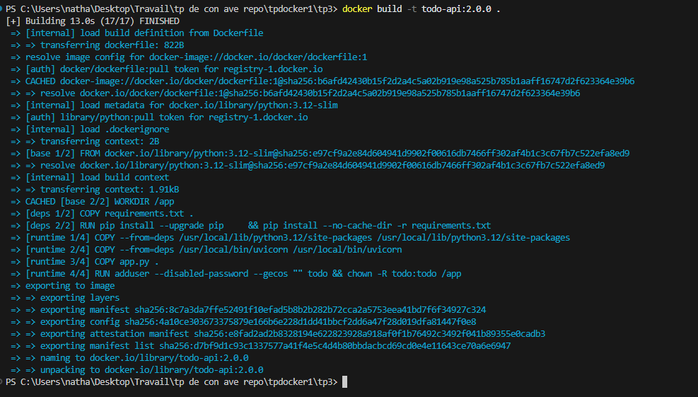
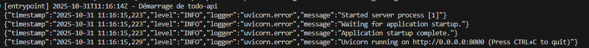
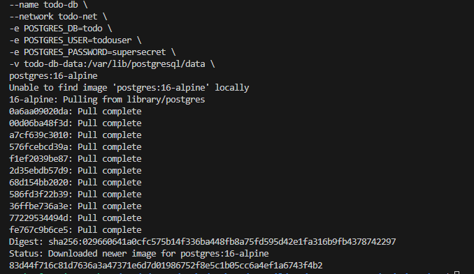

# Tp 3

## Etape 1

-- BUILD

## Etape 2

- Taille des images (après build):

  - multi-stage `todo-api:2.0.0` → 247MB
  - single-stage `todo-api:single` → 250MB

- Différence observée: ~3MB en faveur de l'image multi-stage.

Notes:

- La multi-stage copie uniquement les dépendances nécessaires (site-packages et binaire uvicorn) dans l'image finale, ce qui limite un peu la taille.
- Ici l'écart est modeste car la base `python:3.12-slim` est identique et `pip --no-cache-dir` évite déjà les caches; l'intérêt principal reste la séparation des étapes et la reproductibilité.

### Logs JSON et différence ENTRYPOINT vs CMD

### Logs JSON observés

### ENTRYPOINT vs CMD (récap)

- Rôle

  - ENTRYPOINT: définit le binaire/processus principal lancé au démarrage du conteneur.
  - CMD: fournit les arguments par défaut (ou la commande par défaut si pas d'ENTRYPOINT).

- Ensemble

  - S'ils sont tous les deux présents: Docker exécute `ENTRYPOINT + CMD`.
  - Dans ce TP: `ENTRYPOINT ["./entrypoint.sh"]` et `CMD ["uvicorn", "app:app", "--host", "0.0.0.0", "--port", "8000", "--log-config", "log.ini"]`.
  - `entrypoint.sh` fait `exec "$@"`, donc il lance exactement la commande définie par `CMD`.

- Override à l'exécution

  - `docker run image ...` avec des arguments remplace le `CMD` (mais conserve l'`ENTRYPOINT`).
  - `docker run --entrypoint ... image ...` remplace l'`ENTRYPOINT`.

on met le "quoi exécuter" dans `ENTRYPOINT` (le wrapper/launcher), et les "arguments par défaut" dans `CMD`.

## Etape 3

1. Réseau + base PostgreSQL

Explications (réseaux/volumes):

- Réseau (`todo-net`): permet aux conteneurs de se résoudre par nom DNS (ici `todo-db`) et de communiquer isolément.
- Volume (`todo-db-data`): stocke les données PostgreSQL hors du cycle de vie des conteneurs; les données persistent aux arrêts/redéparts ou recréations du conteneur DB.

## Etape 4 — Tags, push et rollback

Notes rapides (stratégie de tags)

- SemVer: major.minor.patch (ex: 2.2.0), plus `latest` pour l'image actuelle publiée.
- Tag de registre privé: `localhost:5001/todo-api:2.2.0` permet la promotion/rollback sans rebuild.
- `rollback` illustre un alias rapide vers une version antérieure validée.

## Etape 5

observation :

- `todo-db` en fonctionnement (≈20 MiB RAM), `todo-api` non présent au moment du diag, `registry` actif sur 5001.
- Volume listé: `todo-db-data` (persistant).
- Après nettoyage: conteneurs `todo-db` et `registry` supprimés, réseau `todo-net` supprimé, volume `todo-db-data` supprimé.
