# Docker_basics

## Etape 1

#### Docker version

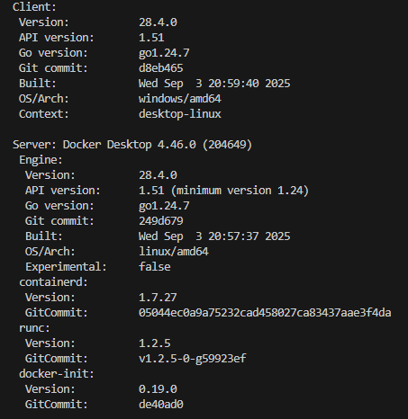

#### Docker Info

1) client

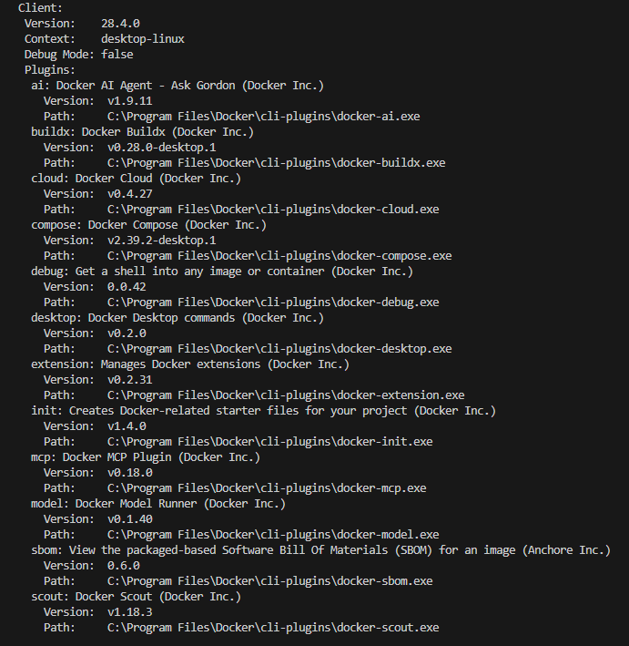

2) server

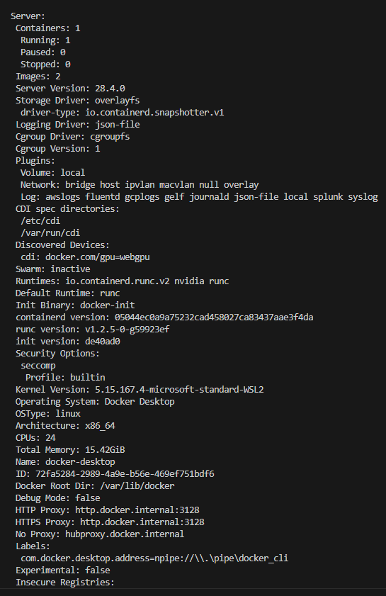

#### docker ps

1) docker ps

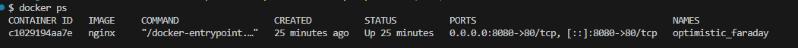

2) docker ps -a

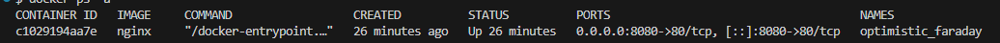

#### docker image ls

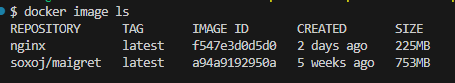

#### docker volume ls

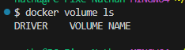

## Etape 2

### Justification du Dockerfile
- `# syntax=docker/dockerfile:1` : force l'utilisation de la dernière syntaxe Dockerfile (BuildKit), pour des builds plus fiables.
- `FROM python:3.12-slim` : image de base officielle, légère et sécurisée, avec Python 3.12.
- `WORKDIR /app` : définit le répertoire de travail pour les commandes suivantes et le process.
- `COPY requirements.txt .` : copie uniquement les dépendances d'abord pour maximiser le cache des couches.
- `RUN pip install --no-cache-dir -r requirements.txt` : installe les dépendances sans conserver le cache afin de réduire la taille de l'image.
- `COPY app.py .` : copie le code applicatif après l'installation des deps pour ne reconstruire que cette couche quand le code change.
- `EXPOSE 5000` : documente le port utilisé par l'application (Flask/Gunicorn écoute sur 5000).
- `CMD ["gunicorn", "--bind", "0.0.0.0:5000", "app:app"]` : commande par défaut de démarrage en prod (Gunicorn), bind sur toutes les interfaces, cible l'objet Flask `app` dans `app.py`.

### Présence et taille image

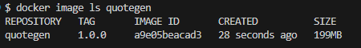

## Etape 3

1) start

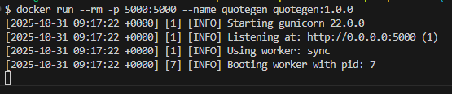

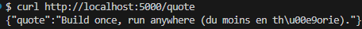

2) stop

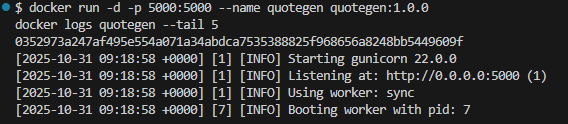

3) inspecte

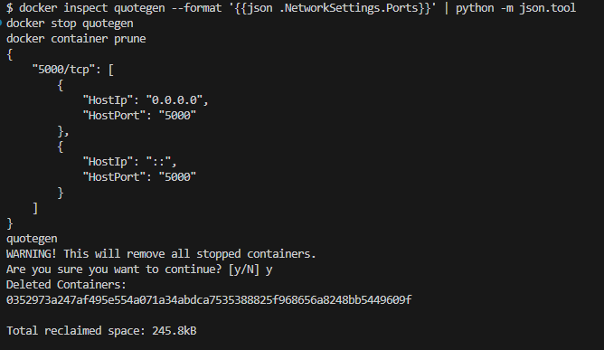

stop: arrête proprement un conteneur en cours d’exécution. Le conteneur reste présent (visible avec docker ps -a).

rm: supprime un conteneur (généralement arrêté). -f force l’arrêt puis la suppression; -v supprime aussi les volumes associés.

prune: nettoie en masse les ressources non utilisées.
- docker container prune: supprime tous les conteneurs arrêtés.
- docker image prune: supprime les images “dangling” (avec -a, toutes les images non utilisées).
- docker volume prune / network prune: suppriment volumes/réseaux non utilisés.
- docker system prune: fait un nettoyage global (avec --volumes pour inclure les volumes).

## Etape 4

### COPY (Dockerfile)
- Copie au build, crée une couche immuable dans l’image.
- Reproductible et indépendant de la machine hôte.
- Idéal pour le code, les assets « par défaut » et les dépendances.
- Augmente la taille de l’image; nécessite un rebuild pour changer le contenu.
- Attention: si un volume est monté au même chemin, il masque ce qui a été copié.

### -v (docker run)
- Monte un répertoire hôte (bind mount) ou un volume nommé au runtime.
- N’appartient pas à l’image; contenu modifiable sans rebuild.
- Idéal en dev (hot reload) ou pour la persistance de données (volumes nommés).
- Moins portable avec bind mounts (dépend des chemins hôte) et possibles soucis perfs/permissions.

Variantes:
- Bind mount: `-v ${PWD}:/app` (masque le contenu de l’image sous `/app`).
- Volume nommé: `-v mydata:/app/data` (persiste les données, détaché du code).

## Etape 5

1) 

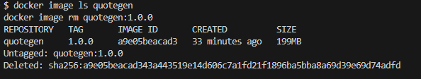

2) Intérêt des tags multiples
- Versionné (`:1.1.0`) : référence immuable à un build précis pour reproductibilité et rollback. À privilégier en prod.
- Flottant (`:latest`) : pratique pour dev/tests rapides; à éviter en prod/CI car il pointe vers un digest changeant.
- Environnement (`:staging`, `:prod`) : facilite la promotion d’images entre environnements par simple retag/push (sans rebuild).
- Variantes SemVer (`:1`, `:1.1`) : permettent de suivre une ligne de compatibilité (maj mineures/patch) tout en restant plus stables que `latest`.

Exemples:
- Build et multi-tag: `docker build -t myapp:1.1.0 -t myapp:latest .`
- Promotion sans rebuild: `docker tag myapp:1.1.0 myregistry/myapp:staging && docker push myregistry/myapp:staging`

3) Inspection des couches et identification des couches lourdes

- Couches lourdes attendues pour ce Dockerfile:
  - `FROM python:3.12-slim` : couche de base (plusieurs dizaines de Mo).
  - `RUN pip install -r requirements.txt` : dépendances Python (Flask, Gunicorn) — souvent la 2e plus grosse couche.
  - `COPY data ./data` : taille proportionnelle au dossier `data` (peut être très lourd).
- Couches légères:
  - `WORKDIR /app`, `COPY app.py`, `EXPOSE 5000`, `CMD ...` : taille négligeable.
- Réduction possible:
  - `.dockerignore` pour exclure fichiers inutiles (ex: `data` brute, `__pycache__`, `.git`, venv, etc.).
  - Monter les données avec `-v` si non nécessaires dans l’image finale, ou les télécharger au démarrage.
  - Garder `COPY requirements.txt` avant `RUN pip install` pour maximiser le cache; `--no-cache-dir` déjà en place.

## Etape 6 — Mini-quiz de validation

1) Différence entre ENTRYPOINT et CMD
- `ENTRYPOINT` définit l’exécutable principal du conteneur (peu souvent remplacé; override via `--entrypoint`).
- `CMD` fournit des arguments par défaut (ou une commande par défaut si pas d’ENTRYPOINT); remplacé par les arguments de `docker run`.
- Ensemble recommandé: `ENTRYPOINT ["gunicorn"]` et `CMD ["--bind","0.0.0.0:5000","app:app"]`.

2) Inspecter les variables d’environnement d’un conteneur en cours d’exécution
- À l’intérieur: `docker exec <container> env` (ou `printenv`).
- Depuis l’hôte (config du conteneur): `docker inspect <container> --format '{{range .Config.Env}}{{println .}}{{end}}'`.
  - PowerShell: garder les quotes simples pour éviter l’interpolation.

3) Diagnostiquer un build qui échoue derrière un proxy d’entreprise
- Vérifier les variables proxy côté hôte: `$env:HTTP_PROXY`, `$env:HTTPS_PROXY`, `$env:NO_PROXY`.
- Passer les proxies au build: `docker build --build-arg HTTP_PROXY=$env:HTTP_PROXY --build-arg HTTPS_PROXY=$env:HTTPS_PROXY --build-arg NO_PROXY=$env:NO_PROXY --progress=plain .`
- Optionnel (Dockerfile): `ARG HTTP_PROXY  ARG HTTPS_PROXY  ARG NO_PROXY` afin que les outils (apt, pip) héritent de l’env.
- Activer des logs de build: `--progress=plain` et des commandes de test réseau (ex: `RUN python -c "import urllib.request as u; u.urlopen('https://pypi.org')"`).
- Proxy daemon (si nécessaire): configurer `C:\ProgramData\Docker\config\daemon.json` (clé `proxies`).

4) Voir l’espace disque consommé par Docker
- `docker system df` (et `docker system df -v` pour le détail par image/containeur/volume).

5) Pourquoi `--rm` est utile en développement ?
- Supprime automatiquement le conteneur à l’arrêt: évite l’encombrement et les conflits de noms.
- Encourage des exécutions éphémères et reproductibles (état propre à chaque run).
- Réduit l’usage disque (pas d’accumulation de conteneurs arrêtés).

