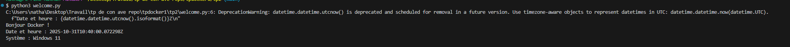
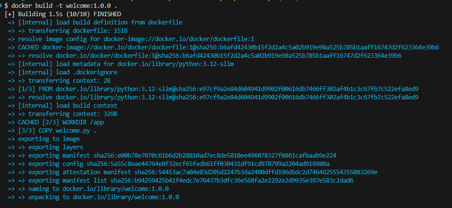
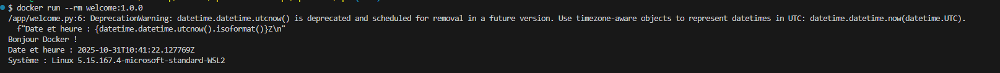
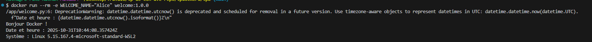
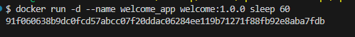
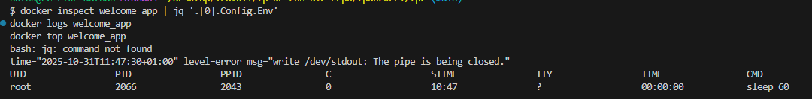

# TP_docker_basic_1 — Docker: Initiation, premiers conteneurs

## Objectif général
Découvrir Docker en manipulant des images existantes, en conteneurisant un script Python simple et en comprenant le cycle de vie d’un conteneur (build, run, inspect, logs, nettoyage).

## Prérequis
- Docker Desktop/Engine opérationnel (Linux containers)
- Terminal PowerShell
- Python 3 local (facultatif, pour comparer)

## Compétences visées
- Vérifier et comprendre l’état du daemon Docker
- Télécharger/Exécuter des images officielles
- Construire une image avec un Dockerfile minimal
- Gérer conteneurs (logs/stop/rm) et nettoyer l’environnement

## Fil rouge du TP
Transformer un script Python « welcome » en image Docker exécutable partout.

---

## Étape 2 — Préparer le projet Python

## Étape 3 — Dockerfile minimal, build et run

3) Build

4) Exécution et comparaison

---

## Étape 4 — Personnaliser l’exécution (CMD, env, override)

1) Variable d’environnement

2) Override de CMD au run

- Explication:
  - `CMD` définit un défaut dans l’image
  - Les arguments après l’image lors de `docker run` remplacent/complètent la commande
  Cela figerait l’exécutable principal alors que `CMD` fournirait ses arguments

---

## Étape 5 — Inspecter, logger, nettoyer

1) Contexte en arrière-plan

2) Métadonnées et processus

- Différence:
  - `docker rm` supprime des conteneurs
  - `docker image rm`/`prune` supprime des images non utilisées

---

## Livrables attendus
- Captures des sorties clés (version, info, hello-world, alpine, build, run, env, inspect, logs)
- Justification du Dockerfile (4 points ci-dessus)
- Réponses courtes aux questions: CMD vs override, différence conteneur/image

## Aller plus loin (optionnel)
- `.dockerignore` pour réduire l’image (exclure `.git`, `__pycache__`, venv, etc.)
- Multi-tag: `welcome:1.0.0`, `welcome:latest`
- `ENTRYPOINT` + `CMD` pour patterns plus robustes
